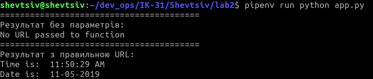
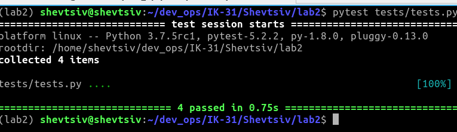
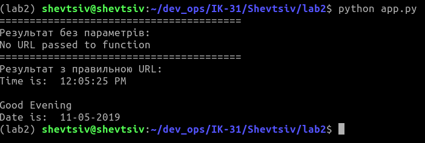
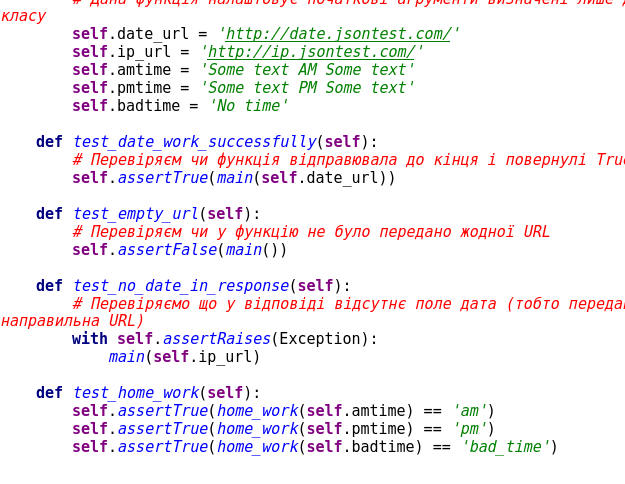
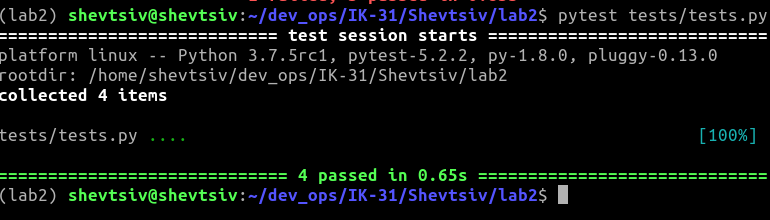

1. Створив папку з лабораторною роботою та додав lab2 README.mdю
2. Інсталював pipenv та ізольоване середовище:
```
	pip install pipenv
	pipenv --python 3.7
```
3. Встановив бібліотеки:
```
	pipenv install requests
	pipenv install ntplib
```
4. Додав файл app.py та скопіював код

5. Програма працює:


6. Встановив бібліотеку pytest командою `pipenv install pytest`

7. Запустив тести:


8. Дописав функцію для перевірки часу доби AM/PM


9. Написав тести:



10. Налаштував вивід в "results.txt". Команда "pytest tests/tests.py > results.txt" та "python app.py >> results.txt"

11. Зробив коміт

12. Заповнив Makefile

13. Закомітив Makefile до репозиторію
