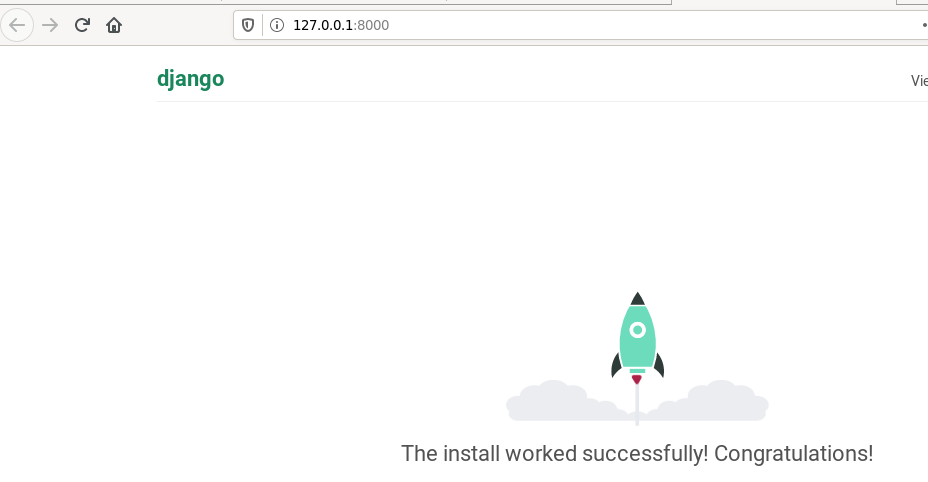
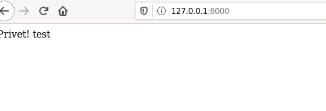

1. Створив папку лабораторної роботи. Ініціалізував середовище та встановив пакети:
```
	pipenv --python 3.7
	pipenv install django
```

2. Створив заготовку проекту та виніс файли на рівень вище.

3. Запустив сервер та переконався що все працює:


4. Зупинив сайт та створив коміт з базовим темплейтом сайту.

5. Створив темплейт додатку, дав йому назву cool_app. Зробив коміт.


6. Створив папку cool_app/templates та файл темплейту main.html та файл cool_app/urls.py.

7. Вказав назви сторінок та де їх шукати.

8. Запустив сайт, все працює:

