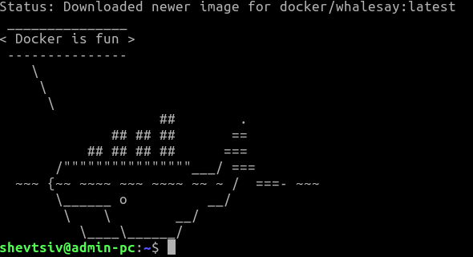

1. Встановив докер та перевірив на працездатність та перенаправив вивід у файл та закомітив:

2. Створив Dockerfile відредагував та закомітив

3. Створив аккаунт в docker-hub та новий репозиторій за прикладом "lab4-examples".

4. Виконав білд імеджу та завантажив його до репозиторію під тегом "django". [Посилання на хаб](https://hub.docker.com/r/shevtsiv/lab4-examples). Скасування імеджу: `docker image rm shevtsiv/lab4-examples:django`

5. Запустив контейнер та перевірив як працює:

6. Створив ще один контейнер для програми моніторингу за прикладом. Назвав файл `Dockerfile.mon`. Забілдив імедж та запустив в паралельних вкладках обидва контейнери: сервер та програму моніторингу, для запуску контейнера моніторингу вказав додаткову опцію `--net=host`, щоб докер знав яку мережу використовувати:

- Створив сховище для контейнера: `docker volume create monvol`
- Запустив контейнер з програмою моніторингу та прив'язав сховище до контейнера: `docker run -it --name=monitoring --net=host --rm shevtsiv/lab4-examples:monitoring -v monvol:/mon`
- Скопіював файл логів командою `docker cp monvol:/app/server.log ./`
