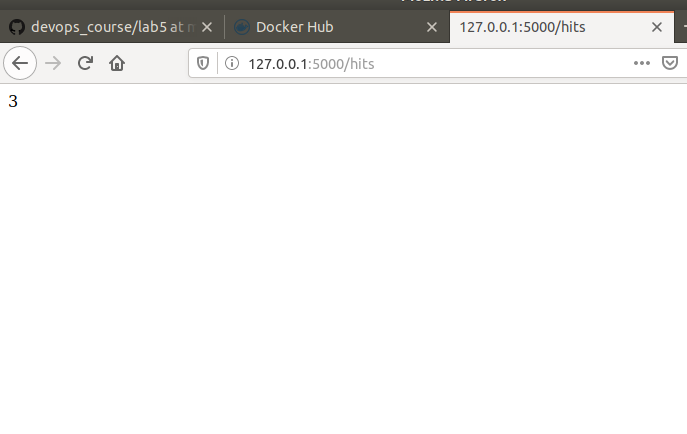

## Makefile
1. Скопіював всі необхідні папки та файли. Файл requirements містить список бібліотек, що необхідно встановити.
2. Виконав команди:

3. Директиви Makefile: States - містить імена імеджів. REPO - назва репозиторію. .PHONY - несправжні цілі (не є файлами). $(STATES): - запускає набір команд для обраних цілей при запуску команди make. run - запускає контейнери. test-app - запускає тести. docker-prune - очистка ресурсів.
4. відредагував Makefile та викнонав необхідні команди для створення, запуску та видалення контейнерів:
- 
- 
- 

5. Створив директиву Makefile для завантаження імеджів. Використав (make upload). Створив директиву для очистки імеджів (make img-clear).

## Docker compose
1. docker compose має дві мережі: одна внутрішня, друга відкрита. До будь якого контейнера вказується перелік мереж до яких він має доступ. Таким чином можна обмежити доступ та взаємодію між контейнерами через мережу.
2. Запустив docker compose. Перевірив працездатність. Потрібно перейти на локальну адресу хоста: localhost на 80 порт, в браузері порт 80 - використовується за замовчуванням
3. Відправив контейнери на свій докер хаб
4. На мою думку у кожного методу свої недоліки й переваги. Але, якщо робота планується з докером, то кращим вибором має бути компоуз. Саме для цього його придумали, напевно.
5. Почистив ресурси docker-compose down
6. (ZAXIST) Створив docker-compose для 4 лабораторної роботи та помістив його в папку з нею.
7. Зробив коміт. Посилання на докерхаб - https://hub.docker.com/r/shevtsiv/lab4-examples/tags
